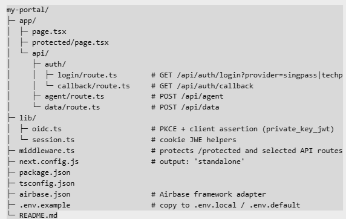

# Next.js + Singpass + DynamoDB + Azure OpenAI (Airbase)

## Local dev
1. `npm i`
2. Copy `.env.example` → `.env.local` and fill values.
3. `npm run dev` then visit http://localhost:3000

## Deploy to Airbase
1. `npx airbase configure` # choose: nextjs-standalone
2. `npx airbase build`
3. `npx airbase deploy`

The CLI prints your live URL, e.g. `https://<project>.app.airbase.sg`.

## Hardening checklist
- Validate ID tokens against provider JWKS (signature, `iss`, `aud`, `nonce`, `exp`).
- Keep LLM calls well under platform timeout; stream or pre-trim prompts.
- Store secrets in envs; rotate keys; prefer KMS/HSM for private keys.
- Use `JSONB` in Postgres if you later switch from DynamoDB but want schemaless docs.

